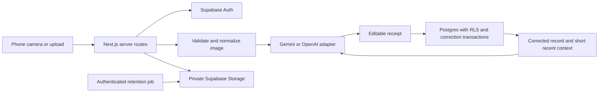

# SlimWaste

Prelaunch status: the interface is deployed, but Supabase provisioning and live account/scan verification are pending. See [launch status](docs/launch-status.md) before using this with real users.

SlimWaste helps students look at food they're throwing away, correct a rough image estimate, and find a practical next step. It supports shared kitchens, irregular shopping, meal plans, limited cooking access, and small budgets.

A single photo cannot measure exact mass. All quantities stay as ranges. Confidence describes the detection, never the person. The corrected record leads the advice. The original model result stays separate for evaluation.

## Run locally

Use Node.js 22 or newer. Run `npm ci`, copy `.env.example` to `.env.local`, fill in the values, and run `npm run dev`. Open `http://localhost:3000`. The sample at `/scan/sample/review` is explicitly labelled and works without accounts or API keys. Missing configuration produces a clear error for live features. It never turns a failed live request into a sample result.

Run `npm test`, `npm run lint`, `npm run build`, and `npm run test:e2e`. Install the test browser once with `npx playwright install chromium`. The browser tests use controlled API fixtures, not real provider calls. Database tests execute the migration in PostgreSQL through PGlite with minimal Supabase auth and storage fixtures. They verify account isolation, atomic corrections, retained original detections, and rate limiting. These checks don't replace testing the deployed Supabase project and a live provider.

## Accounts and database

Create a Supabase project, then apply `supabase/migrations/202609280001_initial.sql` through Supabase migrations (`supabase link --project-ref YOUR_REF`, then `supabase db push`) or the SQL editor. The migration creates all tables, policies, functions, and the private `scan-images` bucket. Never make the bucket public.

Enable email authentication. Set the Supabase site URL to your deployed app URL. In Authentication > Email Templates > Magic Link, use an email code template that includes `{{ .Token }}`. The app asks users to enter this code, and verifies it with `verifyOtp` using type `email`. Configure production SMTP and appropriate email limits before opening registration broadly. Test both a new account and an existing account with real email delivery.

The server validates the signed-in user through Supabase. All private tables have row-level security. Browser credentials cannot write model output, coaching messages, correction snapshots, rate counters, or scan lifecycle fields directly. Corrections pass through a transaction that checks ownership, replaces reviewed items, stores a revision, and invalidates old advice. Server routes check ownership before using the service role.

## Environment

| Variable                        | Purpose                                                                        |
| ------------------------------- | ------------------------------------------------------------------------------ |
| `NEXT_PUBLIC_SUPABASE_URL`      | Project URL                                                                    |
| `NEXT_PUBLIC_SUPABASE_ANON_KEY` | Public project key, protected by RLS                                           |
| `SUPABASE_SERVICE_ROLE_KEY`     | Server-only database and private-storage access                                |
| `AI_PROVIDER`                   | `gemini` or `openai`, exactly one active provider                              |
| `GEMINI_API_KEY`                | Server-only Gemini key when selected                                           |
| `GEMINI_MODEL`                  | Defaults to `gemini-3.8-flash`                                                 |
| `OPENAI_API_KEY`                | Server-only OpenAI key when selected                                           |
| `OPENAI_MODEL`                  | Defaults to `gpt-4.1-mini`                                                     |
| `AI_DATA_USE_ACK`               | Set to `no-training` only after checking the provider account's data-use terms |
| `SCAN_IMAGE_RETENTION_DAYS`     | Derivative retention, defaults to 30 days                                      |
| `RATE_LIMIT_SECRET`             | At least 32 random characters for IP/account HMAC hashes                       |
| `CRON_SECRET`                   | Random secret used to authenticate retention cleanup                           |
| `NEXT_PUBLIC_APP_URL`           | Exact browser origin, including protocol, for mutation origin checks           |

Generate independent random values for the rate limit and cron secrets. Don't commit `.env.local` or copy provider secrets into any `NEXT_PUBLIC_` variable. The repository excludes all real environment files and local deployment configuration.

## AI providers and privacy

| Provider | Adapter                                                                                        | Data-use choice                                                                                                                                                                                |
| -------- | ---------------------------------------------------------------------------------------------- | ---------------------------------------------------------------------------------------------------------------------------------------------------------------------------------------------- |
| Gemini   | Image input and strict JSON output through `generateContent`; current Flash model configurable | Gemini offers limited free usage, but Google lists free-tier inputs as used to improve products. Use a paid-tier project whose terms exclude this use for private scans and corrected records. |
| OpenAI   | Responses API, image input, strict JSON schema, `store:false`                                  | API data isn't used for training by default under the provider's published policy. Standard abuse-monitoring retention may still apply.                                                        |

The operator acknowledgement is a deployment gate, not a way to change Google's terms or a guarantee about an API key. Don't set it for a free-tier project whose terms permit training. Review provider terms for your region and account. There is no automatic fallback between vendors. Separate instructions govern detection and coaching. User notes, names, household context and conversation content are bounded, sanitized, randomly fenced, and sent separately from trusted model instructions. Output must validate before it's stored or shown. These controls reduce prompt injection risk; they don't make a model infallible.

The coach doesn't provide medical nutrition advice, diagnose eating behaviour, or recommend eating visibly unsafe food. Best-before quality and safety are different questions. Advice is brief, practical, and based on corrected scans.

Photos and relevant corrected records are sent to the selected AI provider for inference. SlimWaste does not upload corrections for training. Evaluation consent is off by default. It records permission for a future reviewed, de-identified evaluation process; it does not trigger an export or training job. See [the evaluation plan](docs/evaluation.md).

Official references, checked September 28, 2026: [Gemini models](https://ai.google.dev/gemini-api/docs/models), [Gemini structured output](https://ai.google.dev/gemini-api/docs/structured-output), [Gemini pricing and data use](https://ai.google.dev/gemini-api/docs/pricing), [OpenAI vision](https://developers.openai.com/api/docs/guides/images-vision), [OpenAI data controls](https://developers.openai.com/api/docs/guides/your-data).

## Images, retention, deletion and limits

Uploads accept JPEG, PNG and WebP up to 4 MB, within Vercel's request-body budget. MIME declarations must match decoded content. Animated, malformed and oversized pixel images are rejected. The server rotates phone photos, strips metadata, flattens transparency, and creates a JPEG no wider or taller than 1,600 pixels before model submission. Originals are discarded immediately after processing. Only the cleaned derivative is stored in a private bucket. HEIC must be exported as JPEG first.

Derivative access uses short-lived signed links. A daily authenticated cron deletes expired images, retries storage failures, and cleans old rate counters. Expired photos stop appearing in the app even before the next cleanup runs. Scan text stays until the user deletes the scan. Deleting a scan removes its database records and queues its image for removal. Storage failures are retried. An already-issued signed URL may remain valid briefly, and provider retention follows the provider's terms. Supabase backups follow the project's backup retention policy.

Hourly limits are 12 scans per account and 30 per IP, 40 coaching requests per account and 100 per IP, and 6 email requests per address and 10 per IP. Limits are durable database counters, with HMAC hashes instead of stored raw IP addresses. Deploy behind Vercel so forwarded IP headers are controlled by the platform. The logger records request IDs, durations, operation names and error codes, never raw images or full chat text.

## Architecture

UI routes: `/`, `/sign-in`, `/scan`, `/scan/[id]/review`, `/scan/[id]/coach`, `/history`, `/insights`, `/settings`. The root is the scan surface. The review is a receipt with visible uncertainty. History and insights count reviewed observations without adding incompatible quantity units or inventing carbon equivalences.

The camera/upload sequence takes inspiration from [Hairrison](https://github.com/mutms7/Hairrison). Supabase accounts, bounded conversation context, prompt boundaries, and restrained coaching take inspiration from [GoodLife.AI](https://github.com/mutms7/GoodLife.AI). No unsigned public upload flow or large browser model is reused.

## Deploy

Authenticate GitHub as `mutms7` and Vercel to the intended account. Create the public repository only after verifying that identity. Connect it to a Next.js Vercel project. Apply the Supabase migration and configure the email code template before enabling live accounts. Add environment values through Vercel, separately for preview and production, then deploy. `vercel.json` schedules retention at 04:00 UTC daily; Vercel sends `CRON_SECRET` as its bearer token.

Use an exact `NEXT_PUBLIC_APP_URL` for each environment. Before assigning `slimwaste.vercel.app`, test real sign-in, a real photo, correction persistence, advice, follow-up, history, and deletion with the configured services. Also confirm that a second account can't see the first account's private data. Account access, provider credentials, project quotas, and alias availability are external release requirements. Don't describe a preview with missing services as a verified production release.

## Product facts

Facts are kept separate from personal estimates. [UNEP's 2024 release](https://www.unep.org/news-and-stories/press-release/world-squanders-over-1-billion-meals-day-un-report) reports 1.05 billion tonnes of food waste in 2022, with households responsible for 60 percent. [Environment and Climate Change Canada's Taking Stock page](https://www.canada.ca/en/environment-climate-change/services/managing-reducing-waste/food-loss-waste/taking-stock.html) describes avoidable loss and waste in Canada and common household causes. These population figures aren't used to calculate a student's emissions or savings.
